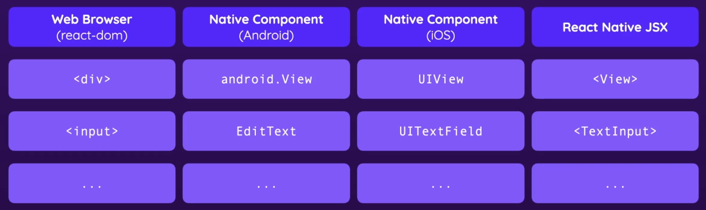

# React native the practical guide course follow-along

## getting started

ReactJS is platform agnostic. React-dom is a library on top of it that is used for web development, React native is for creating platform agnostic mobile apps (IOS / Android).npm 

The react native specific JSX components like `<View>` or `<Text>` are compiled to their equivalent native elements on the respective platforms, the javascript logic itself is not.

Main react native site: https://reactnative.dev
Expo: https://docs.expo.dev/

2 Ways to build: Expo CLI and react Native CLI:

When creating a project using `expo init [projectname]`, react-dom and react-native-web are also added to `package.json` because theoretically web apps can also be built with react native; they are not needed for android / ios.

`app.json` contains configuration information for expo.

Course code:

https://github.com/academind/react-native-practical-guide-code

## Basics

Most important react native components: `View` (like `div`) and `Text` like span.

React native has a small set of [core components](https://reactnative.dev/docs/components-and-apis) that are the building blocks of an App, like html elements are the core components of `react-dom`.

There is no CSS, styles are written inline or as StyleSheet objects in javascript next to the component code. They react native styles are a subset of CSS.

Example (App.tsx of a freshly generated project):

    import { StatusBar } from 'expo-status-bar';
    import { StyleSheet, Text, View } from 'react-native';

    export default function App() {
      return (
        <View style={styles.container}>
          <Text>Open up App.tsx to start working on your app yay!</Text>
          <StatusBar style="auto" />
        </View>
      );
    }
    
    const styles = StyleSheet.create({
      container: {
        flex: 1,
        backgroundColor: '#fff',
        alignItems: 'center',
        justifyContent: 'center',
      },
    });

`View`s can only contain other components, not e.g. plain text.

Using `StyleSheet.create` instead of a plain object offers IDE autocompletion and, potentially, optimization.

https://reactnative.dev/docs/style

Aside: [Adding Eslint and Prettier to a react native project](https://dev-yakuza.posstree.com/en/react-native/eslint-prettier-husky-lint-staged/)

Layout is generally handled using [Flexbox](https://reactnative.dev/docs/flexbox), similar to CSS Flexbox

